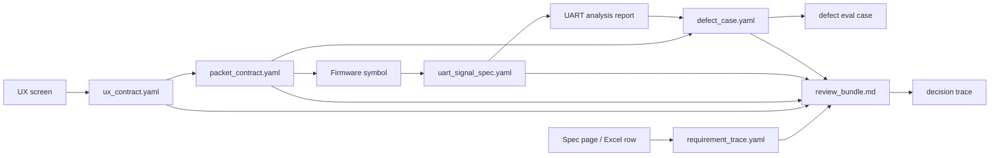

# 12. Context Graph / Agent Memory Evaluation

검증일: 2026-06-25

## 결론

지금 이 devkit에 Neo4j Agent Memory 또는 Create Context Graph를 바로 핵심 런타임으로 붙이는 것은 권장하지 않는다. 현재 이 레포의 목표는 1인 제품 개발자가 사내 S/W 사양, UX, packet, UART, defect 근거를 빠르게 연결하는 것이고, 이미 Markdown/YAML contract와 deterministic script 흐름이 더 가볍고 검증 가능하다.

다만 영상의 핵심 개념인 decision trace, provenance, short/long/reasoning memory는 이 devkit에 유익하다. 즉, 당장은 Neo4j 앱을 도입하지 말고 다음 세 가지를 가볍게 흡수하는 것이 낫다.

1. defect memory에 "어떤 근거와 도구 호출로 판단했는가"를 decision trace로 남긴다.
2. review bundle에 `source -> contract -> signal -> defect -> decision` 경로를 명시한다.
3. 나중에 Neo4j pilot을 할 때는 기존 YAML을 graph import의 원천으로 삼고, raw private source를 직접 넣지 않는다.

## 조사한 자료

| 자료 | 확인 내용 | 판단 |
| --- | --- | --- |
| YouTube `Context Graphs and Agent Memory` | 자동 한국어 자막 기준, context graph는 대화, 엔티티, 사용자 선호, agent tool call, reasoning path를 그래프로 저장해 현재 질문에 필요한 subgraph를 꺼내 쓰자는 내용이다. 영상은 short-term, long-term, reasoning memory의 3계층을 설명한다. | devkit의 "근거 추적" 방향과 잘 맞는다. 단, 영상은 개념 1편에 가깝고 production 도입 검증은 별도다. |
| https://github.com/neo4j-labs/agent-memory | Neo4j 기반 agent memory SDK. Python/TypeScript SDK, NAMS hosted backend, self-hosted bolt backend, MCP server, framework integration, entity extraction, reasoning trace, eval harness를 제공한다. GitHub 기준 Apache-2.0, Experimental/Community Supported, 2026-06-25 조사 시점 public repo다. | 기능 표면은 강하지만 DB와 memory backend가 전제다. 이 devkit의 첫 도입 대상으로는 무겁다. |
| https://github.com/neo4j-labs/create-context-graph | FastAPI + Next.js + Neo4j + agent framework 앱을 scaffold한다. 27개 domain, SaaS connector, decision trace viewer, graph visualization을 생성한다. | 데모/프로토타입에는 유용하다. 이 repo에 바로 scaffold 결과물을 넣는 것은 과하다. |
| https://github.com/getzep/graphiti | temporal context graph. fact validity window, provenance, hybrid retrieval, MCP server를 강조한다. GitHub 기준 Apache-2.0, 2026-06-25 조사 시점 public repo이며 latest release는 `v0.29.2`다. 저장소 backend는 Neo4j/FalkorDB를 중심으로 하며, `falkordblite` extra를 쓰면 embedded file-backed 경로도 있다. | 장기 agent memory 후보로는 가장 강하다. 단, 예쁜 end-user graph UI는 직접 붙여야 하고, SQLite처럼 이미 있는 내부 DB에 그대로 얹는 구조는 아니다. |
| https://github.com/neo4j-labs/llm-graph-builder | PDF/DOC/TXT/YouTube/web 등을 Neo4j knowledge graph로 변환하는 FastAPI + React 앱이다. GitHub 기준 Apache-2.0, 2026-06-25 조사 시점 public repo이며 latest release는 `v0.8.6`이다. | 그래픽으로 graph를 보는 목적에는 가장 가깝다. 단, agent memory라기보다 문서-to-graph builder이고, 보안 설정을 잘못하면 cloud/API 경로가 열린다. |

## 로컬 검증

환경:

- `uv 0.11.21`
- `gh 2.92.0`
- `node v22.23.0`
- Docker: 설치되지 않음
- PowerShell에서 `npm.ps1`은 실행 정책에 막힘. 필요 시 `npm.cmd` 사용 가능

실행 결과:

| 검증 | 결과 | 의미 |
| --- | --- | --- |
| `uvx create-context-graph --version` | `0.13.1` 실행 성공 | CLI는 설치 없이 실행 가능하다. |
| `uvx create-context-graph --list-domains` | `manufacturing`, `software-engineering`, `agent-memory` 등 27개 domain 확인 | embedded AX에 가까운 후보 domain은 있지만 그대로 맞지는 않는다. |
| `create-context-graph ... --domain manufacturing --framework pydanticai --self-hosted --demo-data` | 첫 실행은 Windows cp949 `UnicodeDecodeError` 실패. `$env:PYTHONUTF8='1'` 설정 후 성공 | Windows 사용자는 UTF-8 강제가 사실상 필요하다. |
| scaffold 산출물 | 55 entities, 84 relationships, 25 documents, 10 decision traces 생성 | decision trace 구조는 참고 가치가 있다. |
| 생성 backend 설치 | `uv sync --extra dev` 성공. 167 packages 설치, `torch`, `spacy`, `sentence-transformers`, `transformers`, `litellm` 포함 | 너무 무겁다. devkit 기본 dependency로 넣으면 안 된다. |
| 생성 backend tests | `uv run python -m pytest tests -v` 결과 2 passed | mock 기반 최소 route 검증은 통과했다. 실제 graph/LLM 동작 검증은 아니다. |
| `neo4j-agent-memory extract` 영어 샘플 | `UX screen`, `water_level_liter`, `MCF8316A controller`, `DEFECT-UX-001`, `1L` 추출. 관계는 없음. `0.1L` 누락 | 영어/식별자 혼합 문장에서는 쓸 수 있지만 contract 수준 자동화로는 부족하다. |
| `neo4j-agent-memory extract` 한국어 샘플 | `MCF8316A`, `water_level_liter`, `1L로` 등 일부만 추출. `DEFECT-UX-001`, `WATER_LEVEL`, `0.1L` 누락. 관계는 없음 | 한국어 사내 문서/결함 요약에 바로 적용하기 어렵다. LLM extractor나 규칙 기반 보정이 필요하다. |
| `graphiti-core` 설치/import | 별도 venv에 `graphiti-core==0.29.2` 설치 성공. `OpenAIGenericClient`로 Ollama-compatible endpoint 설정 객체 생성 성공. | library 자체는 Windows/Python 3.11에서 들어온다. local LLM 경로는 가능하다. |
| Graphiti 저장소 옵션 확인 | upstream README와 installed metadata 기준으로 Neo4j, FalkorDB, `falkordblite`, Kuzu, Neptune driver 경로가 있다. `falkordblite`는 `python_version >= '3.12'` marker가 붙은 optional extra다. | "local DB 사용"은 맞지만 기존 SQLite와 동일하다는 뜻은 아니다. Neo4j/FalkorDB server 경로는 별도 process/port/schema 관리가 있고, FalkorDB Lite는 현재 PC 조건에서 미검증이다. |
| `falkordblite` 직접 확인 | 현재 PC의 Python은 `3.11.15`. `python -m pip index versions falkordblite`는 이 환경에서 matching distribution을 찾지 못했다. `graphiti-core[falkordblite] --dry-run`도 Python 3.12 marker 때문에 embedded dependency를 설치하지 않았다. | SQLite에 가까운 file-backed 경로가 있더라도 이 Windows/Python 3.11 PC에서는 아직 실제 효용 검증을 못 했다. Python 3.12 환경을 따로 만들고 재검증해야 한다. |
| Graphiti local 조건 확인 | 현재 PC에는 Ollama 0.30.10과 `qwen3.5:9b`, `qwen2.5-coder:7b` 등 local model이 있다. Docker는 없다. | local LLM은 준비되어 있지만, graph 저장소는 `local Neo4j/FalkorDB server` 또는 `Python 3.12+FalkorDB Lite` 중 하나를 골라야 한다. `GRAPHITI_TELEMETRY_ENABLED=false`도 필수다. |
| LLM Graph Builder local 조건 확인 | repo clone 및 README/env/compose 확인. Python 3.12+, Neo4j 5.23+ with APOC, Docker compose 또는 backend/frontend 분리 실행이 필요하다. 현재 PC는 Python 3.11, Docker 없음, Yarn 없음. | 지금 PC에서는 전체 실행 불가. Docker Desktop 또는 Python 3.12 + Neo4j Desktop + frontend package manager가 먼저 필요하다. |

## SQLite와 Graphiti 저장소의 차이

이미 이 devkit이 SQLite로 내부 데이터를 저장하고 있다면, 보안과 비용 측면에서는 그 방향이 가장 좋다. 내가 "DB 운영 부담"이라고 표현한 것은 local/private 여부가 아니라 운영 단위의 차이를 뜻한다.

- SQLite: 앱 내부 파일 하나로 끝난다. 포트, 계정, 별도 서버 lifecycle, graph index/constraint 초기화가 거의 없다.
- Neo4j/FalkorDB server: 모두 local로 돌릴 수 있지만 DB process, port(`7687`, `6379`, UI port), password, version, backup, index/constraint 초기화를 관리해야 한다.
- FalkorDB Lite: Graphiti가 지원하는 embedded file-backed 선택지라 SQLite에 가장 가깝다. 다만 현재 검증 PC는 Python 3.11이고, upstream 조건은 Python 3.12+라서 아직 이 repo의 현실적인 즉시 도입 근거로 삼기 어렵다.
- Graphiti 안에서 보인 SQLite 사용은 graph 저장소가 아니라 LLM response cache 용도다. 즉, 현재 SQLite DB에 Graphiti graph memory를 그대로 저장하는 공식 경로는 확인하지 못했다.

따라서 이전의 "운영 부담" 판단은 "local DB라서 보안/비용 문제가 있다"가 아니라 "현 PC에서 바로 쓰려면 기존 SQLite보다 관리해야 할 움직이는 부품이 늘어난다"로 읽어야 한다. 이 표현은 아래 권장 방향에 반영한다.

## Graphiti / LLM Graph Builder 추가 비교

| 후보 | 사내용 PC 보안 | 비용 | 그래픽 메모리맵 | 이 devkit과의 적합도 | 판정 |
| --- | --- | --- | --- | --- | --- |
| Existing YAML/Markdown + Mermaid | raw data를 repo에 넣지 않고 contract만 그리면 안전하다. | 무료 | GitHub Markdown에서 Mermaid graph가 바로 보인다. | 매우 높음. 현재 `ux_contract.yaml`, `packet_contract.yaml`, `defect_case.yaml`, `uart_signal_spec.yaml`와 직접 맞는다. | **즉시 채택** |
| Neo4j Agent Memory | self-hosted Neo4j + local LLM이면 가능하나 기본 경로는 NAMS/API key 유혹이 있다. | local이면 무료, hosted/API면 비용 가능 | Neo4j Browser/Bloom/별도 UI 필요 | agent memory model은 좋지만 현재 workflow에는 무겁다. | 보류 |
| Create Context Graph | self-hosted + local LLM 구성이 가능하나 scaffold 앱 자체가 크다. | local이면 무료, LLM API 사용 시 비용 | Next.js graph visualization 포함 | 데모와 pilot에는 좋지만 devkit 기본 기능으로는 과하다. | 보류 |
| Graphiti | local Ollama + local embedding + local Neo4j/FalkorDB 또는 Python 3.12+ FalkorDB Lite + telemetry off이면 사내용 PC 조건을 맞출 수 있다. | local이면 무료. 기본 docs는 OpenAI key를 전제로 하므로 설정 실수 시 비용 발생. | core library에는 예쁜 UI가 없다. Neo4j/FalkorDB server를 쓰면 Browser/Web UI를 볼 수 있지만, FalkorDB Lite는 별도 시각화 export가 필요하다. | 결함/사양 변경처럼 "시간에 따라 사실이 바뀌는 memory"에는 가장 적합하다. 단, 현재 SQLite 저장소와 즉시 통합되는 방식은 아니다. | **장기 pilot 후보, FalkorDB Lite 재검증 필요** |
| LLM Graph Builder | local file + local Neo4j + local Ollama + GCS/S3/web/YouTube 비활성화로 제한해야 안전하다. 기본 frontend는 cloud model과 external Bloom URL 설정을 포함한다. | local Ollama/Sentence Transformers면 무료. OpenAI/Gemini/Diffbot 등 선택 시 비용/API key 필요. | 가장 좋다. 파일별 graph preview, Bloom 연동, chat UI가 있다. | 사내 문서에서 graph를 "보는" 데 강하지만, 반복 defect memory/agent memory에는 직접 맞지 않는다. | **시각화 실험 후보** |

### 사내용 PC에서 허용 가능한 설정

Graphiti를 실험한다면 다음 조건을 모두 만족해야 한다.

```powershell
$env:GRAPHITI_TELEMETRY_ENABLED = "false"
$env:SEMAPHORE_LIMIT = "1"
# Ollama는 localhost만 사용하고, API key는 dummy 값만 사용한다.
# 저장소는 local Neo4j/FalkorDB server 또는 Python 3.12+ FalkorDB Lite만 사용한다.
# 기존 SQLite는 Graphiti graph store가 아니라 devkit 내부 메타데이터/캐시 용도로 유지한다.
```

LLM Graph Builder를 실험한다면 다음처럼 닫힌 설정이 필요하다.

```text
입력 source: local only
LLM: Ollama only
Embedding: Sentence Transformers or local embedding only
GCS/S3/web/YouTube: disabled
VITE_SKIP_AUTH: true only on isolated local PC
VITE_BLOOM_URL: 외부 workspace-preview URL 사용 금지, local Neo4j Browser/Bloom 또는 app preview만 사용
TRACK_USER_USAGE: false
GCP_LOG_METRICS_ENABLED: False
GCS_FILE_CACHE: False
```

## 권장 메모리맵

현재 조건에서 가장 현실적인 그래픽 memory map은 graph DB가 아니라 Markdown/Mermaid다. GitHub에서 바로 그림으로 보이고, 사내 원문 없이 contract key만 노출할 수 있다.



이 map을 다음 단계에서 자동 생성하려면 `make_review_bundle.py`가 contract YAML을 읽어 Mermaid block을 출력하게 하는 것이 가장 비용 대비 효과가 좋다. Graphiti/LLM Graph Builder는 이 Mermaid map으로 충분하지 않을 때만 pilot로 올린다.

## 엄격한 효용 판단

### 지금 도움이 되는 부분

- "왜 이 결론이 나왔는지"를 reasoning trace로 남기는 습관은 UART/packet/defect triage에 바로 유용하다.
- 단순 vector search보다 `UX screen -> required data -> packet field -> firmware source -> UART signal -> defect` 같은 관계형 질문에 더 잘 맞는다.
- `create-context-graph`가 생성한 ontology, decision trace, graph visualization 구조는 future pilot의 참고 자료로 충분하다.
- LLM Graph Builder는 "예쁘게 보는 graph"에는 가장 가깝지만, local-only guard 없이는 사내 자료에 위험하다.
- Graphiti는 "시간에 따라 바뀌는 결함/사양 memory"에는 가장 좋지만, UI가 아니라 engine이다.

### 지금 손해가 더 큰 부분

- Neo4j/FalkorDB server 경로를 쓰면 Docker, Neo4j Desktop, local service 중 하나가 필요하다. 현재 PC에는 Docker가 없다.
- FalkorDB Lite 경로는 서버 부담을 줄이지만 Python 3.12+가 필요하고, 현재 PC의 Python 3.11에서는 설치 검증이 되지 않았다.
- 실제 agent memory 서버를 쓰려면 Neo4j/FalkorDB password, NAMS API key, 또는 LLM API key가 필요할 수 있다. local-only pilot에서는 NAMS/cloud LLM을 쓰지 않는다.
- Windows에서는 scaffold에 `PYTHONUTF8=1` 같은 환경 조건이 필요했다.
- local extraction은 한국어와 도메인 식별자에서 누락이 있었다.
- dependency가 무겁다. 단순 문서/contract repo에 넣기에는 설치 비용이 크다.
- Neo4j Labs project는 community supported 성격이라, 1인 제품 개발자의 핵심 workflow에 곧바로 의존하기에는 리스크가 있다.
- Graphiti는 기본 dependency에 `posthog`가 포함되므로 telemetry opt-out을 강제해야 한다.
- LLM Graph Builder는 기본 예시가 OpenAI/Gemini/Diffbot/Bloom cloud URL을 보여주므로 사내 PC에서는 설정 실수 자체가 보안 리스크다.

## 권장 방향

### Adopt now

1. `defect_case.yaml` 또는 review bundle에 decision trace 필드를 추가하는 pilot을 한다.
2. `make_review_bundle.py`가 `evidence_path`를 다음 형태로 출력하게 한다.
   - `spec_page`
   - `ux_screen`
   - `packet_field`
   - `firmware_symbol`
   - `uart_signal`
   - `defect_case`
   - `decision_trace`
3. LLM/graph 없이도 동작하는 deterministic link check를 먼저 강화한다.
4. `make_review_bundle.py`에 Mermaid memory map 출력을 추가한다.

### Do not adopt now

- `neo4j-agent-memory`를 기본 requirements에 추가하지 않는다.
- `create-context-graph` scaffold 결과물을 이 repo에 직접 vendoring하지 않는다.
- 한국어 사내 자료를 GLiNER extraction에 바로 맡기지 않는다.
- raw private documents를 NAMS 또는 cloud agent memory에 넣지 않는다.
- LLM Graph Builder의 web/YouTube/S3/GCS source를 켠 상태로 사내 원문을 넣지 않는다.
- Graphiti나 LLM Graph Builder를 cloud LLM 기본값으로 실행하지 않는다.

### Future pilot gate

다음 조건이 모두 만족될 때만 Graphiti/Neo4j pilot을 진행한다.

1. local Neo4j/FalkorDB server 또는 Python 3.12+ FalkorDB Lite 중 하나가 준비되어 있다.
2. 민감 자료를 제외한 anonymized sample 3개가 있다.
   - UX screen 3개
   - packet field 3개
   - defect case 5개
3. 다음 질문에 deterministic baseline보다 빠르고 정확히 답한다.
   - "이 defect가 어떤 UX data와 packet field에 연결되는가?"
   - "이 packet scale 변경이 어떤 LCD screen과 defect memory를 건드리는가?"
   - "이 UART signal anomaly 후보의 source contract와 phase rule은 무엇인가?"
4. 설치와 재현 시간이 1시간 이내다.
5. graph 결과가 file path, YAML key, defect id, UART timestamp 중 하나로 되돌아온다.

## 최종 판정

Context graph는 이 devkit의 방향과 맞는다. 그러나 현재 이로움은 "Neo4j를 지금 설치해서 agent memory를 붙이는 것"이 아니라 "관계와 decision trace를 기존 YAML/Markdown workflow에 먼저 심는 것"이다.

따라서 다음 implementation은 graph DB 통합이 아니라, review bundle과 defect memory에 provenance path, decision trace, Mermaid memory map을 추가하는 가벼운 change가 되어야 한다.

Graphiti는 장기 memory engine pilot 후보로 남긴다. 특히 Python 3.12 환경에서 FalkorDB Lite를 검증할 수 있다면 기존 SQLite 운영 감각에 더 가까워질 수 있다. LLM Graph Builder는 사내 문서용 graph visualization 실험 후보로 남기되, Docker/Python 3.12/Neo4j/Ollama/local-only guard가 준비되기 전에는 사용하지 않는다.
