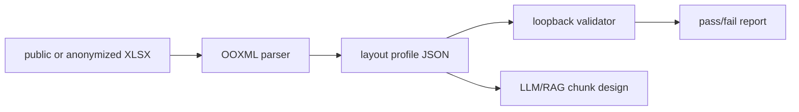

# 13. Excel Layout Loopback Validation

검증일: 2026-06-27

## 목적

복잡한 Excel 사양서를 LLM에게 그대로 넘기면 병합 셀, 넓은 lookup grid, 단위 셀, 좌우 column group 같은 시각적 의미가 쉽게 사라진다. 이 문서는 Excel을 LLM용 지식으로 바꾸기 전에 구조가 제대로 파싱됐는지 확인하는 최소 도구와 검증 절차를 설명한다.

이 repo에는 사내 원본 Excel을 넣지 않는다. 공개 샘플 또는 익명화 샘플만 로컬에서 사용하고, GitHub에는 도구 설명과 검증 절차만 남긴다.

## 공개 샘플 기준

검증에는 공개 heat exchanger sample specification workbook을 사용했다.

- 출처: https://www.perryproducts.com/request-a-quote/
- 직접 파일: https://www.perryproducts.com/wp-content/uploads/2017/08/Sample-Specification-Sheet.xlsx
- repo 반영 범위: raw workbook 미포함, generated profile 미포함

로컬 검증 결과:

| 항목 | 결과 |
| --- | --- |
| sheet count | 1 |
| target sheet | `1 - TEMA` |
| used dimension | `A1:BO63` |
| max column index | 67 |
| non-empty cells | 130 |
| merged ranges | 333 |
| wide merged headers | 315 |
| formula count | 0 |
| loopback validator | `openpyxl` |
| loopback checks | 9 passed, 0 failed |

이 샘플은 한 시트뿐이지만 매우 넓고 병합 셀이 많다. `Shell Side`와 `Tube Side`처럼 좌우로 나뉜 column group, 항목명과 단위가 떨어져 있는 행, 빈 입력칸 중심의 sparse lookup layout이 섞여 있어 단순 CSV 변환의 실패 사례로 적합하다.

## AS-IS 문제

기존 `scripts/ingest_excel.py` 방식은 row 단위 JSONL/Markdown 변환에는 충분하지만, 다음 구조는 잃기 쉽다.

```text
Excel visual layout
  row label + unit cell + merged input area + left/right column group
        ↓
CSV/Markdown table
  empty cells, repeated blanks, unnamed columns
        ↓
LLM interpretation
  group ownership and source evidence can become ambiguous
```

예를 들어 사람은 넓은 병합 셀을 보고 어떤 값이 `Shell Side` 또는 `Tube Side`에 속하는지 읽지만, LLM은 CSV의 빈 칸과 반복 열만 보면 그 관계를 추측해야 한다.

## TO-BE 방식

새 도구 `scripts/inspect_excel_layout.py`는 workbook을 다음 관점으로 profile한다.



도구가 보존하는 핵심 정보:

- sheet name과 used dimension
- non-empty cell count
- merged range count와 merged range digest
- cell coordinate/value fingerprint digest
- formula count
- wide merged header와 multi-group header row 후보
- LLM이 위험하게 해석할 수 있는 layout risk flag

기본 출력은 raw cell value를 저장하지 않고 SHA-256 fingerprint만 저장한다. 공개 문서처럼 원문 공유가 허용된 경우에만 `--include-values`를 사용한다.

## 간단한 구조 예시

단순 변환이 보는 모습:

```text
row 12: Fluid Allocation, ..., Shell Side, ..., Tube Side, ...
row 13: Fluid Name,      ...,            ...,           ...
```

layout profile이 보는 모습:

```yaml
sheet: 1 - TEMA
dimension: A1:BO63
row_group_example:
  - anchor: T12
    merged_range: T12:AQ12
    role: left_column_group_candidate
  - anchor: AR12
    merged_range: AR12:BO12
    role: right_column_group_candidate
evidence:
  merged_range_digest: checked
  cell_fingerprint_digest: checked
```

이렇게 변환하면 LLM/RAG 쪽에서는 `row label`, `unit`, `left/right group`, `source range`를 분리해서 chunk를 만들 수 있다.

## 루프백 검증

검증은 두 단계로 한다.

1. `inspect`: source workbook에서 구조 profile을 만든다.
2. `validate`: profile을 다시 source workbook과 비교한다.

검증 항목:

| check | 의미 |
| --- | --- |
| workbook SHA-256 | 검증한 파일이 profile 생성 파일과 같은지 확인 |
| sheet count/name | sheet 선택이 바뀌지 않았는지 확인 |
| dimension | 사용 범위가 보존됐는지 확인 |
| merged cell count | 병합 셀 누락 여부 확인 |
| merge range digest | 병합 range 전체 집합의 fingerprint 확인 |
| non-empty cell count | 값 있는 셀 누락 여부 확인 |
| cell fingerprint digest | cell coordinate + value fingerprint 전체 집합 확인 |
| formula count | 수식 셀 누락 여부 확인 |

실행 예:

```powershell
python scripts/inspect_excel_layout.py inspect <local-sample.xlsx> `
  --out data/processed/excel_layout/heat_exchanger_profile.json `
  --source-url https://www.perryproducts.com/wp-content/uploads/2017/08/Sample-Specification-Sheet.xlsx

python scripts/inspect_excel_layout.py validate <local-sample.xlsx> `
  --profile data/processed/excel_layout/heat_exchanger_profile.json `
  --out data/processed/excel_layout/heat_exchanger_validation.json `
  --validator openpyxl
```

로컬 검증 결과:

```text
passed=True checks=9 validator=openpyxl
```

`data/processed/**`는 `.gitignore` 대상이므로 generated profile/report는 GitHub에 올라가지 않는다.

## 개선 효과

| 항목 | AS-IS | TO-BE |
| --- | --- | --- |
| 구조 보존 | row text 중심 | 병합 range, cell coordinate, dimension 보존 |
| 근거 추적 | row 번호 중심 | sheet/range/fingerprint 기반 |
| privacy | raw value가 쉽게 남음 | 기본값은 value hash만 저장 |
| 검증 | 변환 후 눈검토 | loopback pass/fail report |
| LLM chunking | 토큰 단위 자르기 | merged header와 lookup group 기반 분할 |

## 적용 원칙

- 사내 Excel 원본은 repo에 commit하지 않는다.
- generated JSON/Markdown/report는 `data/processed/**` 아래에 두고 commit하지 않는다.
- 공개 샘플도 필요한 수치와 도구 설명만 문서화한다.
- raw cell value가 필요한 실험은 로컬에서만 `--include-values`로 수행한다.
- LLM 답변에는 가능한 한 `sheet`, `range`, `field group`, `fingerprint`를 함께 남긴다.
